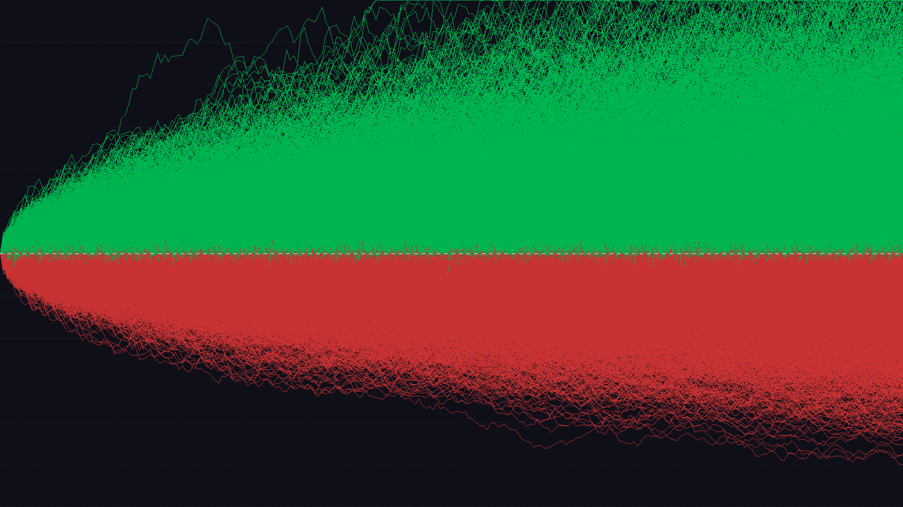
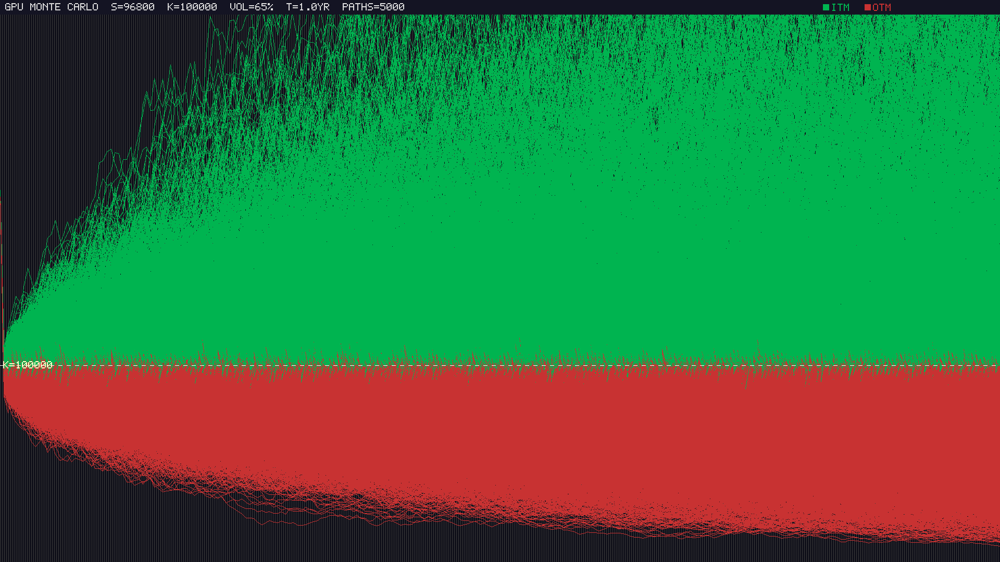
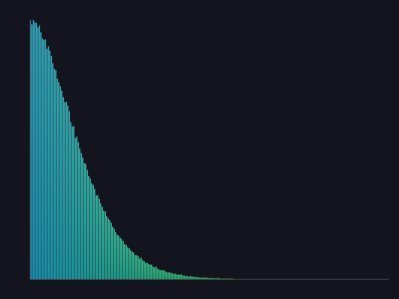
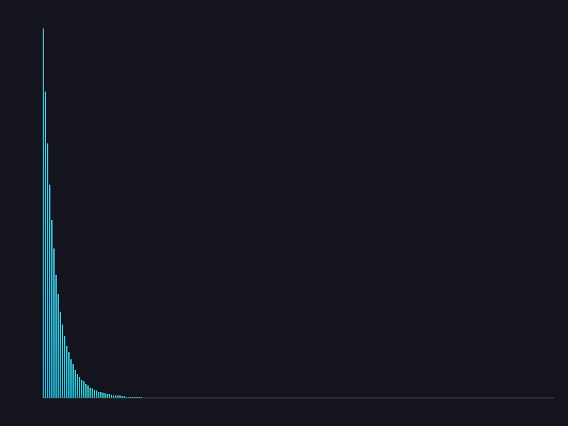

# GPU-Accelerated Monte Carlo Option Pricing Engine

A CUDA-based Monte Carlo simulation engine for pricing financial options with GPU acceleration. Final project for EN605.617 GPU Programming (JHU).

---

## Sample Output

### Spaghetti Plot — Simulated Price Paths

Green = in-the-money (above strike), Red = out-of-the-money (below strike)

| Standard (SPY) | BTC with Jump-Diffusion |
|:-:|:-:|
|  |  |

### Payoff Histograms

| Standard | BTC with Jumps |
|:-:|:-:|
|  |  |

---

## Supported Option Types

```
Payoff ($)                          Payoff ($)
  │                                   │
  │          ╱                    ─────┤ Fixed
  │        ╱                          │
  │      ╱                            │
  ├────╱──────── S              ──────┼──────── S
  │  K                                │  K
  European Call                    Digital Call


Payoff ($)                          Payoff ($)
  │                                   │
  │                                   │      Avg(S) > K
  │          ╱                        │        ╱
  │        ╱                          │      ╱
  ├────╱──────── S              ├────╱──────── S
  │  K                            │  K
  European Put (mirror)            Asian Call
  (via put-call parity)            (avg price path)


Barrier Up-and-Out:  Path touches barrier B → option dies (payoff = 0)
Barrier Down-and-Out: Path touches barrier B → option dies (payoff = 0)
```

---

## Architecture

```
┌─────────────────────────────────────────────────────────┐
│                      CLI / Presets                       │
│  --preset SPY/BTC/ETH    --type european/asian/barrier   │
│  --jumps btc/crisis       --dashboard    --benchmark     │
└───────────────────────────┬─────────────────────────────┘
                            │
                ┌───────────▼───────────┐
                │     Host (CPU)        │
                │  Parse args, allocate │
                │  memory, launch       │
                └───────────┬───────────┘
                            │
          ┌─────────────────┼─────────────────┐
          ▼                 ▼                 ▼
  ┌──────────────┐ ┌──────────────┐ ┌──────────────┐
  │   Stream 0   │ │   Stream 1   │ │   Stream N   │
  │              │ │              │ │              │
  │ ┌──────────┐ │ │ ┌──────────┐ │ │ ┌──────────┐ │
  │ │  cuRAND  │ │ │ │  cuRAND  │ │ │ │  cuRAND  │ │
  │ │  Init    │ │ │ │  Init    │ │ │ │  Init    │ │
  │ └────┬─────┘ │ │ └────┬─────┘ │ │ └────┬─────┘ │
  │      ▼       │ │      ▼       │ │      ▼       │
  │ ┌──────────┐ │ │ ┌──────────┐ │ │ ┌──────────┐ │
  │ │MC Kernel │ │ │ │MC Kernel │ │ │ │MC Kernel │ │
  │ │ GBM +    │ │ │ │ GBM +    │ │ │ │ GBM +    │ │
  │ │ Payoff   │ │ │ │ Payoff   │ │ │ │ Payoff   │ │
  │ └────┬─────┘ │ │ └────┬─────┘ │ │ └────┬─────┘ │
  │      ▼       │ │      ▼       │ │      ▼       │
  │ ┌──────────┐ │ │ ┌──────────┐ │ │ ┌──────────┐ │
  │ │ Reduce   │ │ │ │ Reduce   │ │ │ │ Reduce   │ │
  │ │(shared)  │ │ │ │(shared)  │ │ │ │(shared)  │ │
  │ └──────────┘ │ │ └──────────┘ │ │ └──────────┘ │
  └──────────────┘ └──────────────┘ └──────────────┘
          │                 │                 │
          └─────────────────┼─────────────────┘
                            ▼
              ┌──────────────────────────┐
              │   Results & Validation   │
              │  • MC Price ± Std Err    │
              │  • Black-Scholes Check   │
              │  • Greeks (Δ Γ ν Θ ρ)    │
              │  • PPM Visualization     │
              └──────────────────────────┘
```

### Memory Layout

```
┌─────────────────────────────────────────────┐
│              Constant Memory                │
│  Strike(K), Spot(S), Rate(r), Vol(σ), T     │
│  Barrier level, Jump params                 │
└─────────────────────────────────────────────┘

┌─────────────────────────────────────────────┐
│              Global Memory                  │
│  cuRAND states  │  Payoff results  │  PPM   │
└─────────────────────────────────────────────┘

┌──────────────────────┐
│    Shared Memory     │  Per-block partial
│  [sum0][sum1]...[sN] │  sum reduction
└──────────────────────┘

┌──────────────────────┐
│     Registers        │  Per-thread running
│  price, accumulator  │  price path state
└──────────────────────┘
```

---

## Features

- **Option Types** — European, Asian, Barrier (Up/Down-and-Out), Digital (Call/Put)
- **Monte Carlo Simulation** — Millions of price paths simulated in parallel on GPU
- **Black-Scholes Validation** — Analytical pricing for European options to verify accuracy
- **Greeks** — Delta, Gamma, Vega, Theta, Rho via bump-and-reprice
- **Merton Jump-Diffusion** — Model crash/black swan events with configurable jump parameters
- **CUDA Streams** — Concurrent portfolio pricing (8 options on 4 streams)
- **GPU Visualization** — Spaghetti plots and payoff histograms rendered directly on GPU
- **Interactive Dashboard** — ncurses-based real-time parameter adjustment with ASCII sparklines
- **CPU Baseline** — Side-by-side comparison with single-threaded CPU implementation
- **Benchmarking** — Block-size sweeps, path-count scaling, CPU vs GPU timing

---

## Requirements

- NVIDIA GPU (developed on RTX 3060 Ti, compute capability 8.6)
- CUDA Toolkit 11.5+
- GCC 11+
- ncurses (for dashboard mode)

## Build & Run

```bash
make all
./mc_pricer --help
```

### Quick Examples

```bash
# European call with default params
./mc_pricer

# SPY preset
./mc_pricer --preset SPY

# BTC with jump-diffusion
./mc_pricer --preset BTC --jumps btc

# Asian option
./mc_pricer --type asian

# Interactive dashboard
./mc_pricer --dashboard

# Benchmark mode
./mc_pricer --benchmark
```

---

## Performance

### CPU vs GPU Speedup

| Paths | CPU (ms) | GPU (ms) | Speedup |
|------:|---------:|---------:|--------:|
| 10K | 83.07 | 0.38 | **217x** |
| 100K | 831.84 | 1.55 | **536x** |
| 1M | 8,312.23 | 18.02 | **461x** |

### Block Size Sweep (1M paths)

| Block Size | Kernel (ms) | Throughput (Mpaths/s) |
|-----------:|------------:|----------------------:|
| 32 | 2.33 | 429 |
| 64 | 2.24 | 446 |
| 128 | 1.72 | 582 |
| **256** | **1.65** | **605** |
| 512 | 1.67 | 600 |
| 1024 | 1.72 | 580 |

### Convergence (Monte Carlo error vs Black-Scholes)

| Paths | Error (%) | Std Error | Kernel (ms) |
|------:|----------:|----------:|------------:|
| 1K | 7.96 | 0.4394 | 0.04 |
| 10K | 0.90 | 0.1458 | 0.05 |
| 100K | 0.20 | 0.0469 | 0.49 |
| 1M | 0.13 | 0.0147 | 1.56 |
| 5M | 0.01 | 0.0066 | 9.32 |
| 10M | 0.01 | 0.0047 | 16.89 |

---

## Project Structure

```
├── src/
│   ├── main.cu              # CLI parsing, entry point
│   ├── monte_carlo.cu       # MC simulation kernels (European, Asian, Barrier, Digital)
│   ├── reduction.cu         # Shared-memory parallel reduction
│   ├── black_scholes.cu     # Analytical Black-Scholes pricing
│   ├── greeks.cu            # Greeks via bump-and-reprice
│   ├── streams.cu           # Multi-stream portfolio pricing
│   ├── render_ppm.cu        # GPU spaghetti plot + histogram rendering
│   ├── cpu_baseline.cpp     # CPU reference implementation
│   └── dashboard.cu         # ncurses interactive dashboard
├── include/
│   └── option_params.h      # Option parameter structs, constants
├── benchmark/
│   └── run_benchmarks.sh    # Automated benchmark script
├── output/                  # Sample output images and benchmark CSVs
├── Makefile
└── proposal.md
```

---

## Author

Daniel Kim — Johns Hopkins University, EN605.617 GPU Programming
